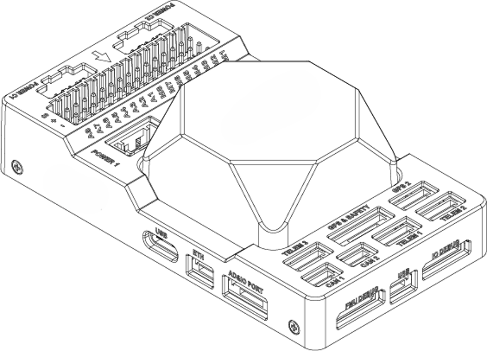
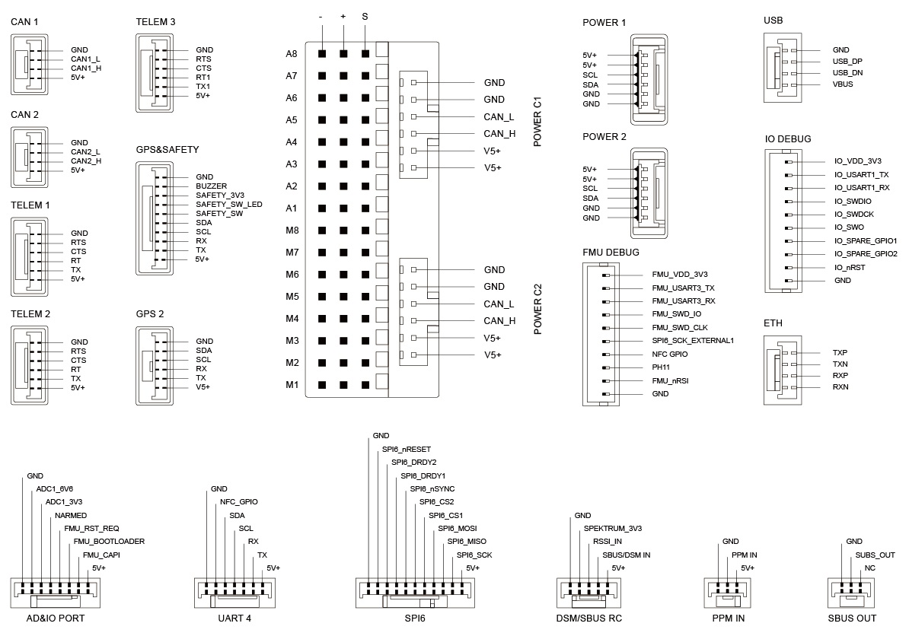
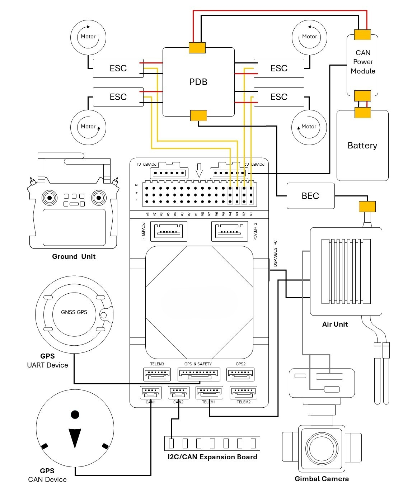
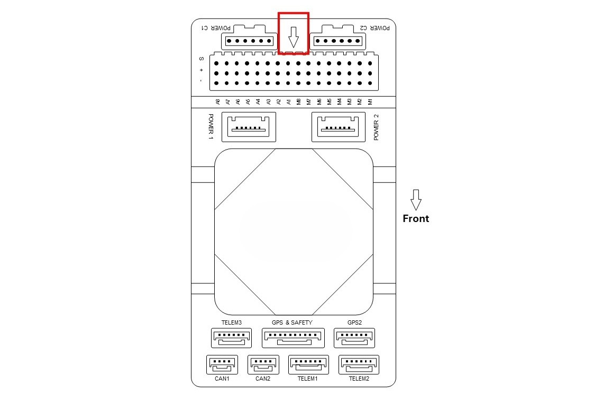
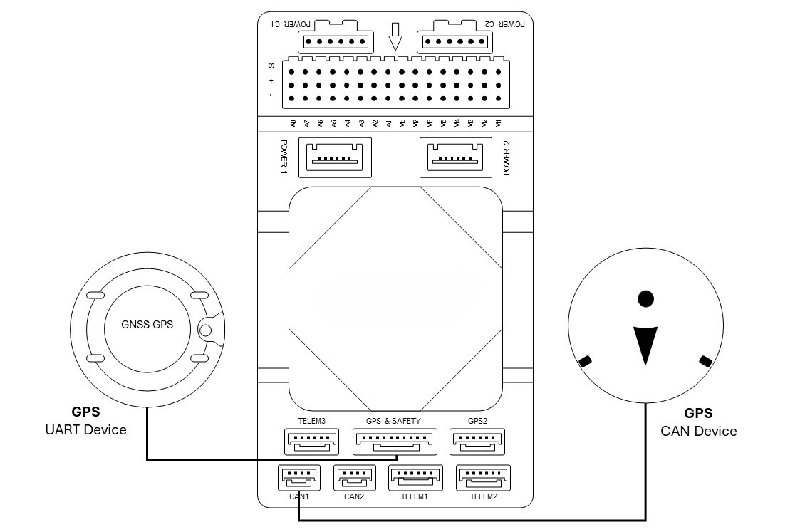
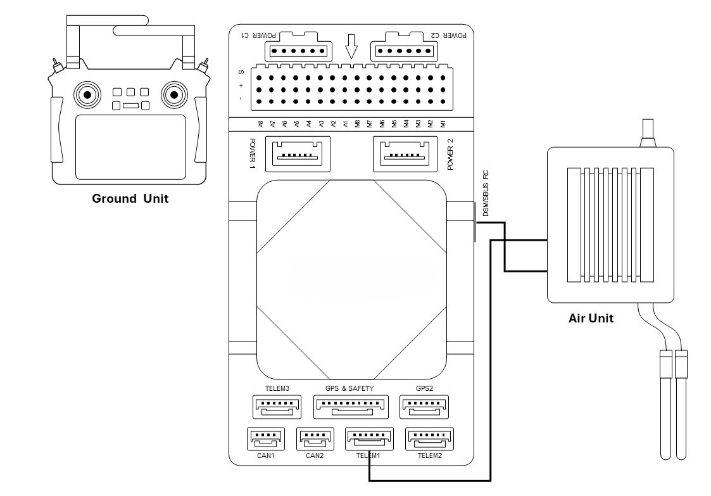
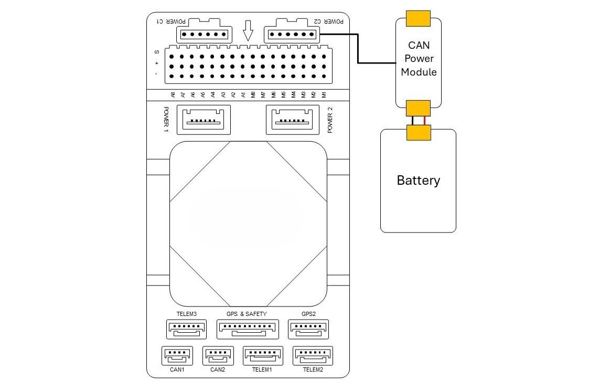
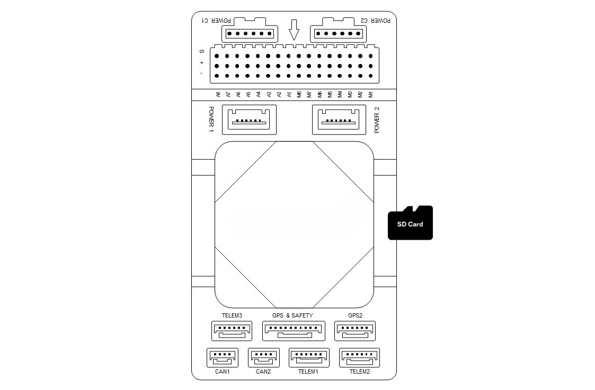
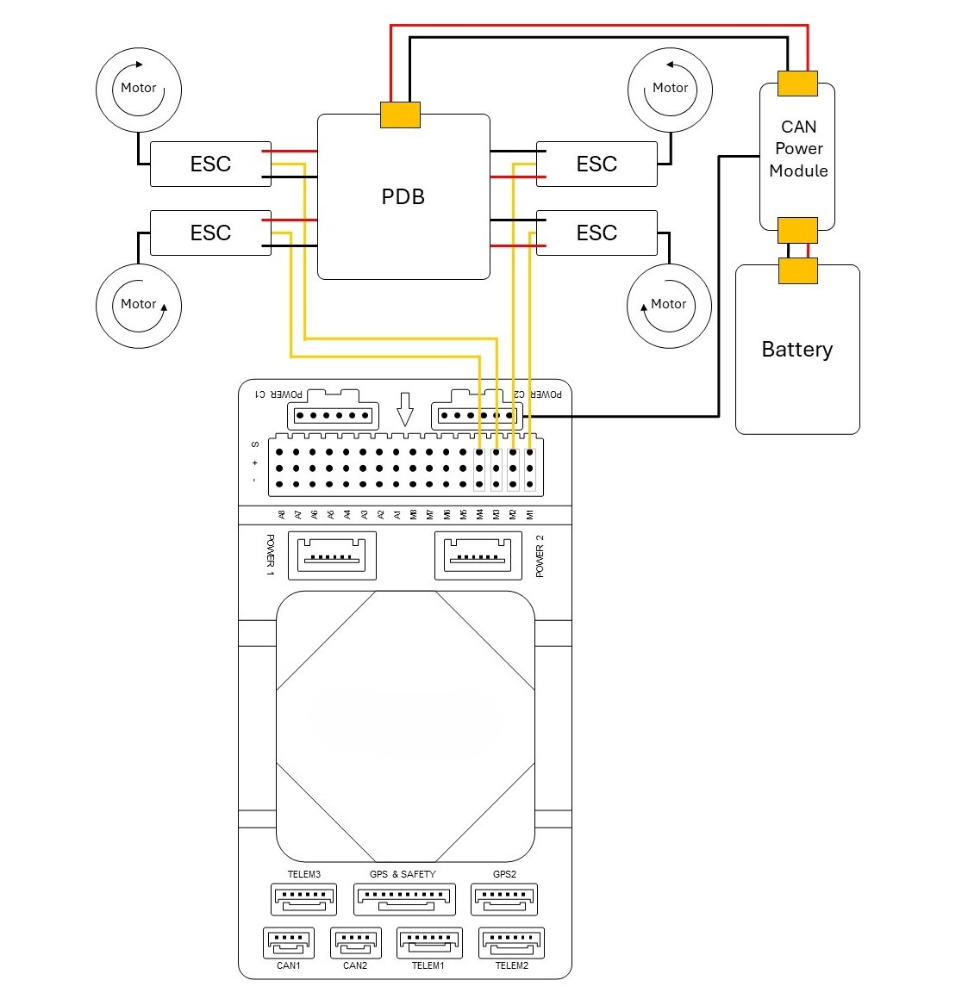

# Flight Controller | ArduPilot & PX4 Supported

The flight controller is a state-of-the-art universal flight controller developed based on the Pixhawk Autopilot v6X standard. It adopts an STM32H753 double-precision floating-point FMU processor and an STM32F103 I/O coprocessor with independent buses and power supplies. Equipped with multiple IMUs featuring 6-axis inertial sensors, barometric pressure/temperature sensors, and a geomagnetic sensor, it is engineered for high reliability, flight safety, and extensive expansion capabilities. With an integrated 10/100M Ethernet Physical Layer (PHY), the flight controller can communicate directly with mission computers (companion computers), high-resolution mapping cameras, and other UxV payload systems at high speeds.

---

## Product Information

### Hardware Summary

| Item | Specification / Description |
| :--- | :--- |
| **FMU Processor** | STM32H753 (Arm® Cortex®-M7, 480 MHz) |
| **IO Processor** | STM32F103 (Arm® Cortex®-M3, 72 MHz) |
| **Memory** | 2 MB Flash memory, 1 MB RAM |
| **Sensors** | • Bosch BMI088 IMU sensor (vibration isolated) • TDK InvenSense ICM-42688-P IMU sensor ×2 (one vibration isolated) • TDK ICP-20100 barometric pressure and temperature sensor ×2 (one vibration isolated) • PNI RM3100 geomagnetic sensor (vibration isolated) |
| **IO Interface** | • 2× CAN Bus (CAN1 and CAN2) • 3× TELEM Port (TELEM1, TELEM2, and TELEM3) • 2× GPS Port (Safety switch / LED / Buzzer, and GPS2) • 1× PPM IN • 1× SBUS OUT • 2× USB Port (1× Type-C and 1× JST GH1.25) • 1× 10/100Base-T Ethernet Port • 1× DSM / SBUS RC • 1× UART4 • 1× AD&IO Port • 2× Debug Port (1× IO Debug and 1× FMU Debug) • 1× SPI6 Bus • 2× Power Input with I2C bus (Power 1 and Power 2) • 2× Power Input with CAN bus (Power C1 and Power C2) • 16× PWM Servo Output (A1–A8 from STM32H753 on FMU board; M1–M8 from STM32F103 on IO board) • 1× MicroSD Socket (Push-Pull, supports SD 4.1 & SDIO 4.0 in 1-bit default and 4-bit modes) |
| **MicroSD Card** | Not included in the package |
| **Power Requirement** | 4.6 V to 5.7 V |
| **Current Ratings** | • TELEM1 and GPS2 combined output current: 1.5 A (max) • All other ports combined output current: 1.5 A (max) |
| **Operating Temperature** | -40 °C to +55 °C |
| **Storage Temperature** | -40 °C to +70 °C |
| **Operating Humidity** | 5% to 95% (non-condensing) |
| **Casing Material** | ABS (carrier board), Diecast Aluminum Alloy (IMU cover) |
| **Dimensions** | 92.2 mm (L) × 51.2 mm (W) × 28.3 mm (H) |
| **Weight** | 77.6 g (carrier board with IMU) |

---

### Pin Definition

---

### Wiring Overview

The diagram below illustrates the flight controller and its peripheral connections.

| Interface | Function / Description |
| :--- | :--- |
| **POWER C1** | Connect CAN PMU to POWER C1. Used with UAVCAN power modules. |
| **POWER C2** | Connect CAN PMU to POWER C2. Used with UAVCAN power modules. |
| **POWER 1** | Connect to an SMBus (I2C) power module. |
| **POWER 2** | Connect to an SMBus (I2C) power module. |
| **GPS & SAFETY** | Connect to a primary GPS module (integrates GPS, safety switch, and buzzer). |
| **GPS2** | Connect to a secondary GPS / RTK module. |
| **UART4** | Available for user customization. |
| **TELEM1 / 2 / 3** | Connect to telemetry transceivers or MAVLink companion devices. |
| **MicroSD CARD** | Insert a MicroSD card for flight logging and mission data storage. |
| **A1–A8** | Configurable PWM / GPIO. Supports bidirectional DShot (Bdshot); connects camera shutter, hot shoe, servos, etc. |
| **M1–M8** | PWM outputs from the IO coprocessor. Connect to ESCs and servos. |
| **USB** | Connect to a computer for universal controller communication (e.g., parameter tuning, firmware flashing). |
| **CAN1 / CAN2** | Connect to DroneCAN / UAVCAN devices. |
| **DSM / SBUS / RSSI** | Signal input interface for DSM, SBUS, or RSSI receivers. |
| **PPM** | Connect to a PPM RC receiver. |
| **ETH** | Connect to onboard Ethernet network devices. |
| **AD&IO** | Analog input interface (ADC 3.3V or ADC 6.6V). Typically reserved. |
| **FMU Debug** | Debug port for developers and advanced diagnostic usage. |
| **IO Debug** | Debug port for IO coprocessor firmware flashing and diagnostics. |

---

### Serial Port Mapping

| UART Port | Device Path | Default Assigned Function |
| :--- | :--- | :--- |
| **USART1** | `/dev/ttyS0` | GPS |
| **USART2** | `/dev/ttyS1` | TELEM3 |
| **USART3** | `/dev/ttyS2` | Debug Console |
| **UART4** | `/dev/ttyS3` | UART4 |
| **UART5** | `/dev/ttyS4` | TELEM2 |
| **USART6** | `/dev/ttyS5` | PX4IO / RC |
| **UART7** | `/dev/ttyS6` | TELEM1 |
| **UART8** | `/dev/ttyS7` | GPS2 |

---

### Power Consumption

#### Operating Voltage

| Parameter | Minimum | Typical | Maximum |
| :--- | :--- | :--- | :--- |
| **Input Voltage** | 4.6 V | 5.0 V | 5.4 V |

#### Current Consumption

| Operating State | Typical | Maximum |
| :--- | :--- | :--- |
| **Flight Controller + Connected Peripherals** | 3.0 A | 3.44 A |
| **Flight Controller Only** | 0.44 A | 0.58 A |

---

## Quick Start

This guide provides instructions on powering the universal flight controller and connecting its essential peripherals.

For complete flight software documentation and flight modes, refer to:
* [ArduPilot Official Documentation](https://ardupilot.org/ardupilot)
* [PX4 Autopilot User Guide](https://docs.px4.io/main/en/index.html)

---

### Vehicle Orientation

:::tip Note on Mounting Orientation
If the flight controller cannot be mounted in the default forward-facing orientation due to airframe layout, configure the flight controller orientation parameters in the ground control software (GCS) accordingly.
:::

---

### Firmware Support

The flight controller is fully supported by both ArduPilot and PX4 autopilot firmware.

* **ArduPilot:**
  * [Source Code Repository](https://github.com/ArduPilot/ardupilot/tree/master/libraries/AP_HAL_ChibiOS/hwdef/AcctonGodwit_GA1)
  * [Stable Release (Copter)](https://firmware.ardupilot.org/Copter/stable/AcctonGodwit_GA1)
  * [Stable Release (Plane)](https://firmware.ardupilot.org/Plane/stable/AcctonGodwit_GA1)
  * [Stable Release (Rover)](https://firmware.ardupilot.org/Rover/stable/AcctonGodwit_GA1)
* **PX4 Autopilot:**
  * [PX4 Source Code](https://github.com/PX4/PX4-Autopilot/tree/main/boards/accton-godwit/ga1)
  * [PX4 Stable Release Firmware](https://github.com/PX4/PX4-Autopilot/releases/tag/v1.17.0)

#### Loading Firmware via Mission Planner

Loading firmware through **Mission Planner** is recommended:
1. Download and install [Mission Planner](https://ardupilot.org/planner/docs/mission-planner-installation.html).
2. Connect the flight controller to your computer using a USB Type-C cable.
3. Open Mission Planner, navigate to **INITIAL SETUP** > **Install Firmware**, and select the desired firmware image file.

---

### Peripheral Connections

#### GPS & Compass Module
* Connect your GPS/RTK module to the **GPS & SAFETY** or **GPS2** port.
* The primary GPS module typically includes an internal compass, safety switch, buzzer, and RGB LED indicator.
* Ensure the module is mounted away from high-current power lines and motors, with the arrow pointing toward the vehicle front.
* DroneCAN / UAVCAN GNSS modules can be connected to the **CAN1** or **CAN2** bus.

#### Radio Control & Telemetry System
* **Telemetry:** Connect the air telemetry transceiver to **TELEM1**, **TELEM2**, or **TELEM3** to establish ground control station (GCS) communication.
* **RC Receiver:** Connect DSM/SBUS satellite receivers to the **DSM/SBUS** interface. If using a PPM receiver, connect it to the **PPM** interface.

#### Power Module (PMU)
* Connect a compatible CAN PMU module (supporting 3S–14S LiPo batteries) to **Power C1** or **Power C2** via the 6-pin connector.
* Under ArduPilot, the DroneCAN PMU is plug-and-play. Under PX4, configure the DroneCAN PMU driver as required.
* Analog and I2C power modules are also supported via the **Power 1** and **Power 2** ports.

#### MicroSD Card
* Insert a MicroSD card into the slot before flight. High-rate flight logs and IMU analysis data require storage on the MicroSD card.

#### Motor & Servo Connections
* Connect ESCs and servos to the **M1–M8** and **A1–A8** headers according to the motor sequence specified for your airframe configuration.

#### Servo Rail Power Supply
:::caution External Power Required for Servos
The flight controller internal regulator does not supply power to the servo rail (`+` pins on M1–M8 and A1–A8). An external BEC or dedicated power supply must be connected to the positive and negative rails of the servo headers to power any servos.
:::

---

## Useful Links

* **ArduPilot Documentation:**
  * [First Time Setup Guide](https://ardupilot.org/copter/docs/flying-arducopter.html)
  * [ArduPilot Flight Controller Hardware Page](https://ardupilot.org/copter/docs/common-acctongodwit-ga1.html)
* **PX4 Autopilot Documentation:**
  * [PX4 Basic Concepts](https://docs.px4.io/main/en/getting_started/px4_basic_concepts)
  * [PX4 Multicopter Assembly](https://docs.px4.io/main/en/frames_multicopter/)
  * [PX4 Flight Controller Hardware Page](https://docs.px4.io/main/en/flight_controller/accton-godwit_ga1)
  * [Pixhawk Standard Autopilot Overview](https://docs.px4.io/main/en/flight_controller/autopilot_pixhawk_standard)
